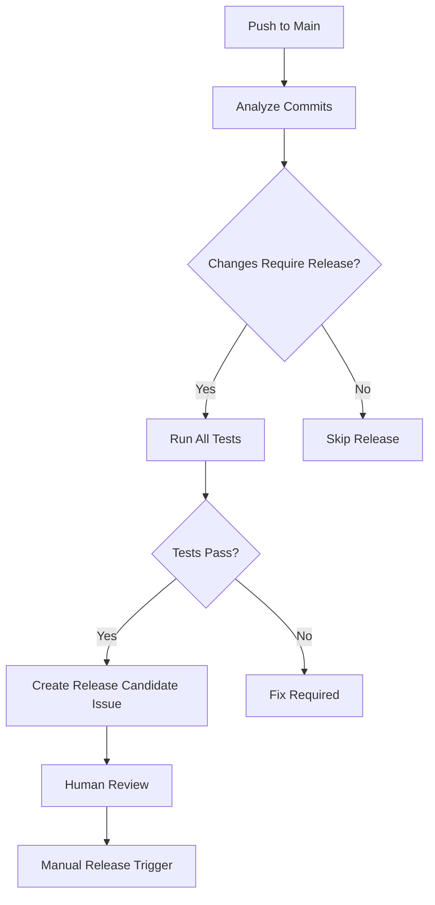

# Automated Release Strategy

## 🎯 **Hybrid Approach: Smart Automation + Human Control**

This repository uses a **semi-automated release strategy** that combines the best of automation with human oversight.

## 🔄 **How It Works**

### **1. Automatic Analysis (Push to Main)**


### **2. Semantic Versioning Analysis**
The system analyzes commit messages to determine version bump:

| Commit Pattern | Version Bump | Example |
|---------------|--------------|---------|
| `feat!:` or `BREAKING CHANGE` | **Major** | v1.0.0 → v2.0.0 |
| `feat:` | **Minor** | v1.0.0 → v1.1.0 |
| `fix:` | **Patch** | v1.0.0 → v1.0.1 |
| Other | **None** | No release needed |

## 🚀 **Release Workflows**

### **Auto Release Candidate**
**Trigger**: Push to main with releasable changes  
**Actions**:
- ✅ Analyze commits for semantic versioning
- ✅ Run comprehensive test suite
- ✅ Generate release notes automatically
- ✅ Create GitHub issue with release proposal
- ✅ Provide one-click release commands

### **Manual Release**
**Trigger**: Workflow dispatch (manual)  
**Actions**:
- ✅ Validate version format
- ✅ Check tag doesn't exist
- ✅ Run full test suite
- ✅ Create and push tag
- ✅ Trigger release pipeline

## 🎛️ **Usage Examples**

### **Scenario 1: Automatic Flow**
```bash
# 1. Push feature to main
git push origin main

# 2. GitHub creates release candidate issue
# "🚀 Release Candidate: v1.0.24"

# 3. Review issue and run suggested command
gh workflow run "Manual Release" -f version="v1.0.24"
```

### **Scenario 2: Manual Override**
```bash
# Direct manual release anytime
gh workflow run "Manual Release" \
  -f version="v1.0.25" \
  -f release_notes="Emergency security fix"
```

### **Scenario 3: Custom Version**
```bash
# Override suggested version
gh workflow run "Manual Release" -f version="v2.0.0"
```

## ✅ **Benefits of This Approach**

### **Automation Benefits**
- 🚀 **Speed**: Fast turnaround when ready
- 🔍 **Consistency**: Semantic versioning analysis
- 📝 **Documentation**: Auto-generated release notes
- 🧪 **Safety**: Always runs full test suite

### **Human Control Benefits**
- 🎯 **Review**: Human eyes on every release
- 🛠️ **Flexibility**: Override version/notes anytime
- ⏸️ **Control**: Can skip releases easily
- 🔒 **Security**: No accidental releases

### **Best of Both Worlds**
- ⚡ **Efficient**: Minimal manual work
- 🛡️ **Safe**: Human oversight preserved
- 📊 **Predictable**: Clear process and triggers
- 🔄 **Flexible**: Works for all release scenarios

## 🎮 **Quick Commands**

```bash
# Check what would be released
git log $(git describe --tags --abbrev=0)..HEAD --oneline

# Manual release (latest version)
gh workflow run "Manual Release" -f version="v1.0.24"

# Emergency release with custom notes
gh workflow run "Manual Release" \
  -f version="v1.0.25" \
  -f release_notes="Critical security update"

# View release candidate issues
gh issue list --label "release-candidate"
```

## 🔧 **Configuration**

### **Commit Message Standards**
Use [Conventional Commits](https://conventionalcommits.org/):
- `feat: add new API endpoint` → Minor release
- `fix: resolve authentication bug` → Patch release  
- `feat!: change API structure` → Major release
- `docs: update README` → No release

### **Workflow Triggers**
- **Auto Analysis**: Every push to main
- **Manual Release**: Workflow dispatch anytime
- **Package Testing**: After release completes

This strategy gives you **automation efficiency** with **human wisdom** - the perfect balance for reliable releases! 🎯