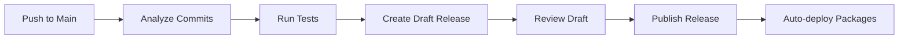

# Draft Release vs GitHub Issues: Comparison

## 📊 **Approach Comparison**

| Aspect | GitHub Issues | Draft Release |
|--------|---------------|---------------|
| **Visibility** | High (notifications, labels) | Medium (releases page) |
| **Discussion** | Excellent (comments, mentions) | Limited (no comments) |
| **Release Notes** | Manual copy/paste needed | Ready-to-publish |
| **Review Process** | Natural (issue workflow) | Direct (edit & publish) |
| **Automation** | Complex (issue → tag → release) | Simple (draft → publish) |
| **History** | Preserved in issues | Lost when published |
| **Team Workflow** | Familiar (like PR reviews) | New process to learn |
| **One-Click Release** | No (multiple steps) | Yes (edit + publish) |

## 🎯 **Recommendation: Draft Release Approach**

### **Why Draft Release is Better for mpesa-cli:**

#### ✅ **Advantages**
1. **Streamlined Flow**: Draft → Review → Publish (no extra steps)
2. **Ready to Ship**: Release notes already formatted and complete
3. **Visual Appeal**: Rich markdown with emojis and formatting
4. **Installation Instructions**: Pre-populated in release notes
5. **One-Click Publish**: Just click "Publish release" button
6. **Professional Look**: Standard GitHub releases UI

#### ✅ **Enhanced Features We Could Add**
```yaml
- Auto-generated changelogs with commit links
- Installation instructions for all platforms  
- Breaking change warnings prominently displayed
- Comparison links to previous versions
- Asset validation before publishing
- Slack/email notifications when draft is ready
```

#### ✅ **Workflow Integration**


### **When to Use Issues Instead:**
- **Large teams** that need extensive discussion
- **Complex release decisions** requiring stakeholder input
- **Regulatory environments** requiring audit trails
- **Teams unfamiliar** with GitHub releases workflow

## 🚀 **Hybrid Approach (Best of Both)**

For maximum flexibility, we could implement **both** and make it configurable:

```yaml
# In workflow file
env:
  RELEASE_STRATEGY: "draft"  # or "issue"
  
- name: Create Release Candidate
  if: env.RELEASE_STRATEGY == 'draft'
  # Draft release logic
  
- name: Create Release Issue  
  if: env.RELEASE_STRATEGY == 'issue'
  # Issue creation logic
```

## 💡 **My Strong Recommendation**

For **mpesa-cli**, I recommend the **Draft Release approach** because:

1. **Simpler workflow**: Fewer steps to final release
2. **Better UX**: Users see polished release notes immediately
3. **Professional appearance**: Matches established OSS patterns
4. **Easier maintenance**: Less complex automation logic
5. **Better discoverability**: Releases tab is the standard place users look

The current **GitHub Issues approach** is excellent for learning and transparency, but **Draft Releases** are more production-ready for a CLI tool! 🎯

Would you like me to implement the Draft Release version to replace the current issue-based approach?